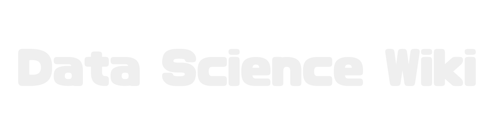

### Hi there 👋

- 🔭 I am currently working as a data scientist and machine learning engineer in Tokyo.
- 🌱 I study natural language processing, especially in-context learning, quantum machine learning, and quantum optimization.
- I am involved in a research automation project called [Autores](https://sites.google.com/view/automated-research/home?authuser=0).

    

## Repositories that may be useful
- [data-science-wiki](https://github.com/fuyu-quant/data-science-wiki)
  A variety of machine learning methods are summarized.(Currently, it is available only in Japanese.)
  [Data Science Wiki](https://www.data-science-wiki.net/)

  

- [IBL:Inductive-bias Learning](https://github.com/fuyu-quant/IBLM)
  A new method for learning predictive models using LLM.
  [arXiv](https://arxiv.org/abs/2308.09890)

- [dockerfile-wiki](https://github.com/fuyu-quant/dockerfile-wiki)
  Various docker environments for data scientists．

- [langchain-wiki](https://github.com/fuyu-quant/langchain-wiki)
  Introduce various applications using LangChain

- [quantum-algorithm-wiki](https://github.com/fuyu-quant/quantum-algorithm-wiki)
  Summary of various quantum algorithms(Currently under construction)

- [awesome-quantum-programming-language](https://github.com/fuyu-quant/awesome-quantum-programming-languages)
  Curation site for programming languages and libraries for quantum computation and quantum computation simulators.

## My Favorite Repositories
- [OSS Insight](https://ossinsight.io/collections/)

- [awesome](https://github.com/sindresorhus/awesome)

- [stable diffusion webui colab](https://github.com/camenduru/stable-diffusion-webui-colab)

